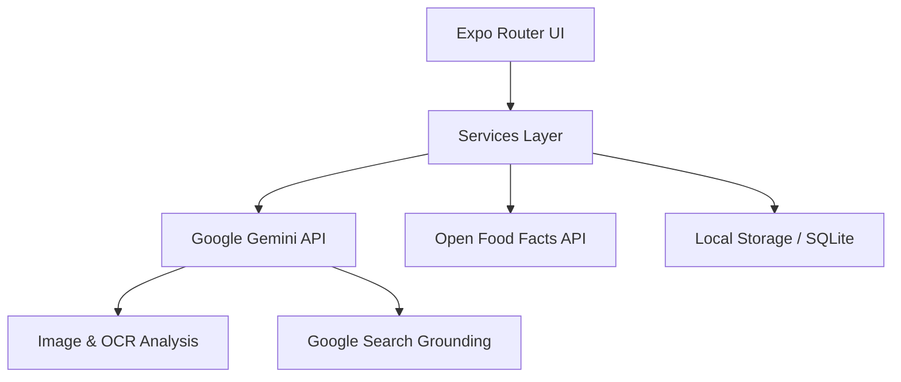

<div align="center">
  
  <h1>Root Route</h1>
  <p><b>Vom Feld bis ins Regal – Transparenz, die man schmecken kann.</b></p>

  [](https://expo.dev)
  [](https://reactnative.dev)
  [](https://www.typescriptlang.org)
  [](https://ai.google.dev)
</div>

---

**Root Route** ist eine wegweisende mobile App zur Revolutionierung der Transparenz in Lebensmittel-Lieferketten. Wir nutzen die Kraft von Künstlicher Intelligenz (Google Gemini) und Crowd-Sourcing, um das Vertrauen zwischen Produzenten und Konsumenten wiederherzustellen.

## 🚀 Features

| Feature | Beschreibung |
|:---|:---|
| **Barcode-Scanner** | Superschnelles Scannen von EAN/UPC-Codes direkt im Supermarkt. |
| **OCR / KI-Batch-Scan** | Foto der Packung genügt – die Gemini KI erkennt Produkt & Charge (LOT) automatisch. |
| **Interaktive Journey-Timeline** | Vollständige Transparenz vom Feld bis zur Filiale mit verifizierten IoT-Events und GPS-Daten. |
| **Crowd-Validation** | Nutzer verifizieren Daten vor Ort und melden Unstimmigkeiten direkt in der App. |
| **KI-Sicherheits-Check** | Echtzeit-Prüfung auf Produktrückrufe und Allergene basierend auf aktuellen News. |
| **Nachhaltigkeits-Scores** | Detaillierte Einblicke in Nutri-Score, Eco-Score und den CO₂-Fussabdruck. |
| **Intelligenter KI-Assistent** | Chatbot auf Basis von Gemini 2.5 Flash für komplexe Fragen zu Herkunft und Inhaltsstoffen. |
| **Smart Pantry** | Verwalte deinen Vorratsschrank inklusive Ablaufdatum-Monitoring und IoT-Haltbarkeitsprognosen. |
| **Gamification & Trust** | Sammle Punkte für nachhaltiges Handeln und steige in der Community-Rangliste auf. |

---

## 🛠 Tech Stack

| Kategorie | Technologie |
|:---|:---|
| **Frontend Framework** | React Native 0.81.5 + Expo SDK 54 |
| **Navigation** | Expo Router (File-based Routing, Stack + Tabs) |
| **Core AI** | Google Gemini 2.5 Flash (Multimodal & Search Grounding) |
| **Geospatial** | react-native-maps (Google Maps Integration) |
| **Computer Vision** | expo-camera & Vision API für OCR |
| **Data Persistence** | AsyncStorage mit lokaler Cache-Strategie |
| **Testing** | Jest & Testing Library (E2E Readiness) |
| **Data Sources** | Open Food Facts API & Simulated IoT Sensor Streams |

---

## 📋 Voraussetzungen

| Ressource | Version | Link |
|:---|:---|:---|
| **Node.js** | ≥ 18.x | [Download](https://nodejs.org) |
| **npm** | ≥ 9.x | – |
| **Expo Go** | Aktuelle Version | – |

---

## 📱 App auf dem Smartphone starten (Expo Go)

1. **Expo Go installieren:** Suche im App Store (iOS) oder Play Store (Android) nach „Expo Go".
2. **Netzwerk-Konfiguration:** Stelle sicher, dass Smartphone und PC im selben WLAN sind (oder PC am Smartphone-Hotspot).
3. **QR-Code scannen:** Nach dem Starten (`npm start`) den im Terminal angezeigten QR-Code mit der Kamera (iOS) oder Expo Go (Android) scannen.

> [!TIP]
> Die Barcode- und OCR-Funktionen benötigen zwingend die Hardware-Kamera. Wir empfehlen den Test auf einem physischen Gerät statt im Simulator.

---

## ⚙️ Setup & Start

```bash
# 1. Repository klonen
git clone <repo-url>
cd cucumber-app

# 2. Abhängigkeiten installieren
npm install --force

# 3. Umgebungsvariablen konfigurieren
cp .env.example .env
# Edit .env: Setze EXPO_PUBLIC_GEMINI_API_KEY=dein_schluessel

# 4. Dev-Server starten
npm start
```

---

## 🔑 Umgebungsvariablen

Kopiere `.env.example` → `.env` und konfiguriere:

| Variable | Erforderlich | Beschreibung |
|:---|:---:|:---|
| `EXPO_PUBLIC_GEMINI_API_KEY` | Ja | API Key aus [Google AI Studio](https://aistudio.google.com/) |

---

## 🧪 Testing

Qualitätssicherung steht bei uns an erster Stelle.

```bash
npm test                # Alle Unit-Tests ausführen
npm run test:watch      # Watch-Mode für die Entwicklung
npm run test:coverage   # Testabdeckung generieren
```

Abgedeckte Module: `Carbon Footprint`, `Shelf Life Prediction`, `Gamification Logic` und `Data Parsers`.

---

## 🏗 Architektur



### Design-Philosophie

- **Privacy First**: Nutzerdaten verbleiben lokal auf dem Gerät.
- **Offline Capability**: Zentrale Produktdaten sind für Schweizer Marken lokal gepuffert.
- **AI Resilience**: Fallback-System über mehrere Gemini-Modelle und Grounding-Strategien.

---

## 🛡 Sicherheit & Datenschutz

- **Sicherer Key-Transport**: API-Schlüssel werden niemals hartcodiert und über `.env` injiziert.
- **Datenminimierung**: Keine Erfassung personenbezogener Daten. Scans werden nur lokal gespeichert.
- **Transparente Berechtigungen**: Kamera-Zugriff erfolgt ausschliesslich nach expliziter Bestätigung durch den Nutzer.

---

## ⚠️ Bekannte Einschränkungen (Hackathon-MVP)

- Die Lieferketten-Daten für die Journey Timeline sind simuliert; die API-Struktur ist jedoch für reale ERP/RFID-Integrationen vorbereitet.
- Die Community-Rangliste basiert derzeit auf lokalen Demo-Daten.
- Produktrückrufe werden via AI-Live-Suche geprüft, was zu Verzögerungen führen kann.

---
<div align="center">
  <sub>Entwickelt für den <b>TIE International Hackathon 2026</b></sub>
</div>
